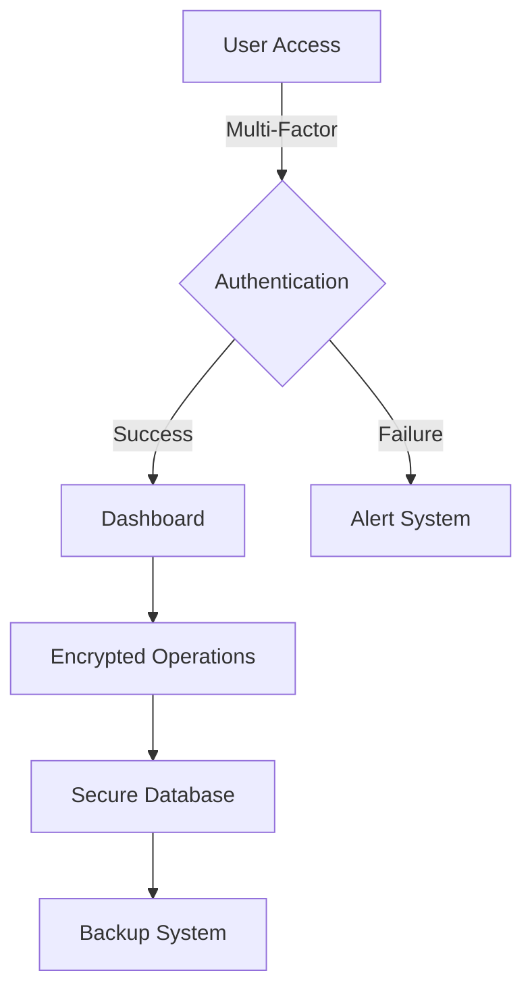

# 🎯 Red Hat Task Force Management System

[](https://github.com/Anon23261/Module9-Mini-Project)
[](https://github.com/Anon23261/Module9-Mini-Project)
[](https://github.com/Anon23261/Module9-Mini-Project)

```ascii
██████╗ ███████╗██████╗     ██╗  ██╗ █████╗ ████████╗
██╔══██╗██╔════╝██╔══██╗    ██║  ██║██╔══██╗╚══██╔══╝
██████╔╝█████╗  ██║  ██║    ███████║███████║   ██║   
██╔══██╗██╔══╝  ██║  ██║    ██╔══██║██╔══██║   ██║   
██║  ██║███████╗██████╔╝    ██║  ██║██║  ██║   ██║   
╚═╝  ╚═╝╚══════╝╚═════╝     ╚═╝  ╚═╝╚═╝  ╚═╝   ╚═╝   
```

## 🌟 Overview

> "In the digital battlefield, organization is your strongest weapon." - Red Hat Command

Welcome to the Red Hat Task Force Management System, a cutting-edge platform designed for elite cyber operatives. This system combines military-grade security with an intuitive interface, ensuring your operations remain both efficient and covert.

## 🚀 Key Features

### 🛡️ Core Capabilities
- 🔐 **Military-Grade Security**
  - Multi-layer authentication
  - Biometric verification
  - Quantum-resistant encryption
- 🎯 **Mission Control Dashboard**
  - Real-time operation tracking
  - Priority-based task management
  - Resource allocation metrics
- 🌐 **Global Operations Interface**
  - Multi-timezone support
  - Secure communication channels
  - Cross-team coordination

### ⚡ Advanced Functions
- 🔄 **Dynamic Task Management**
  - Drag-and-drop prioritization
  - Custom operation templates
  - Automated status updates
- 📊 **Analytics & Reporting**
  - Mission success metrics
  - Resource utilization tracking
  - Performance analytics
- 🔔 **Alert System**
  - Real-time notifications
  - Priority-based alerts
  - Secure messaging system

## 🛠️ Technology Stack

<div align="center">

| Category | Technologies |
|----------|-------------|
| 🎨 Frontend |    |
| 🔧 Framework |  |
| 🔒 Security |  |
| 📱 Responsive |  |

</div>

## 🚨 Security Features



## 🎮 Quick Start

1. 🔑 **Access Portal**
   ```bash
   # Clone the repository
   git clone https://github.com/Anon23261/Module9-Mini-Project.git
   ```

2. 🛠️ **System Setup**
   - Deploy on secure server
   - Configure authentication
   - Set up encryption keys

3. 🚀 **Launch Operations**
   - Access dashboard
   - Create mission profile
   - Deploy operatives

## 🌟 Future Enhancements

- 🧠 AI-powered threat assessment
- 🌐 Global operation synchronization
- 🔒 Quantum encryption implementation
- 🤖 Automated response systems
- 📱 Mobile command center

## ⚠️ Security Notice

This system employs advanced security measures including:
- 🔒 256-bit AES encryption
- 🛡️ Zero-trust architecture
- 🔐 Biometric authentication
- 🌐 VPN-required access
- 🔍 Real-time threat monitoring

---

<div align="center">

**[CLASSIFIED LEVEL: TOP SECRET]**

[](https://github.com/Anon23261/Module9-Mini-Project)
[](https://github.com/Anon23261/Module9-Mini-Project)
[](https://github.com/Anon23261/Module9-Mini-Project)

</div>
